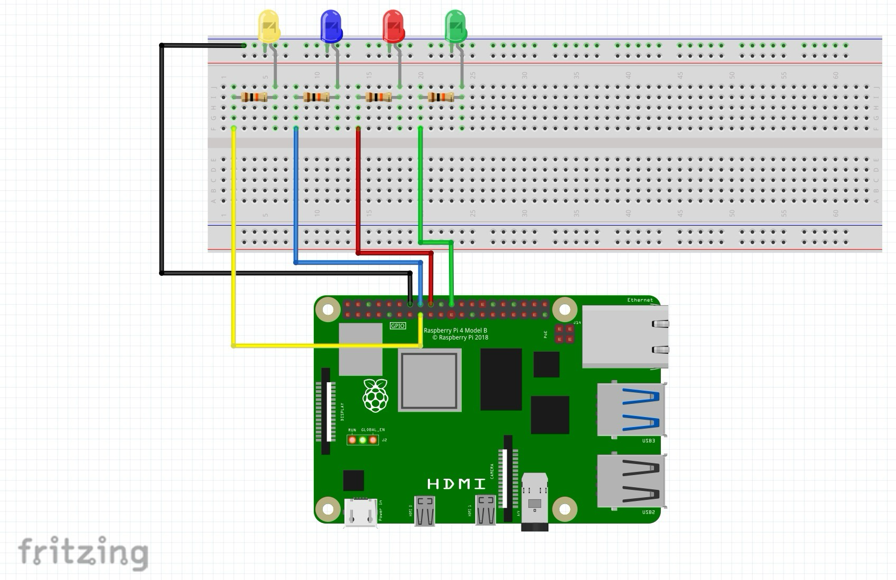
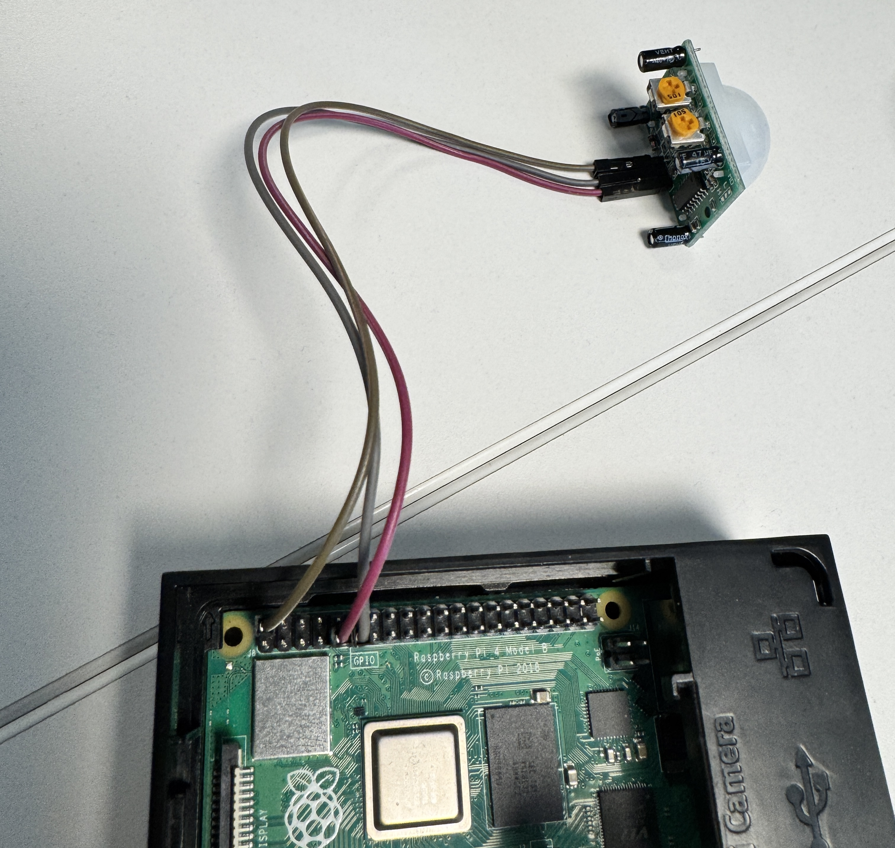
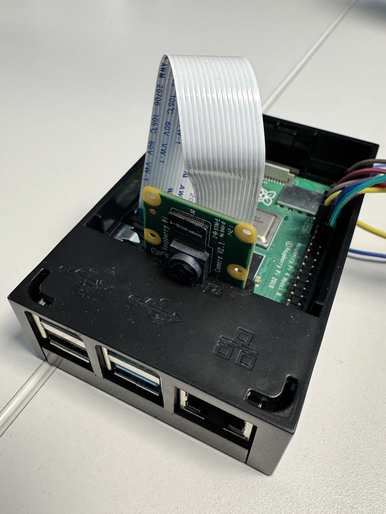

# Waste Classifier for Raspberry Pi 4

This project is a Raspberry Pi 4 based waste classification system. A PIR motion sensor detects movement, the Raspberry Pi camera captures an image, a TensorFlow Lite model classifies the waste item, and the system responds through LED indicators and a simple dashboard.

The system is built as a closed-loop IoT solution where AI output triggers meaningful actions:
- image capture
- classification with a `.tflite` model
- LED feedback on the breadboard
- live information shown in a Flask dashboard

## Main features

- Motion detection using a PIR sensor
- Image capture using **Pi Camera Module 2**
- Waste classification using **TensorFlow Lite**
- LED indication for class result
- Flask dashboard for system status and results
- Raspberry Pi based hardware setup

## Hardware required

The project uses the following hardware:

- **Raspberry Pi 4 Model B**
- **Pi Camera Module 2**
- **PIR motion sensor**
- **Breadboard**
- **4 LEDs**
- **4 resistors** (we used 10kΩ)
- **Jumper wires**
- **MicroSD card with Raspberry Pi OS**
- **Power supply for Raspberry Pi**
- Optional: monitor, keyboard and mouse for setup/debugging

## Hardware setup

### 1. LED wiring



*Fritzing illustration of the LED wiring on the Raspberry Pi.  
The PIR sensor and Pi Camera Module 2 are not shown in this diagram and are documented separately with physical photos.*

The breadboard setup in the Fritzing illustration shows the LED part of the circuit.

- Each LED is connected to a separate GPIO pin
- Each LED uses a resistor in series
- All LEDs share a common ground rail
- The Raspberry Pi ground is connected to the breadboard ground rail

Example GPIO setup used in the project:

| Component | Raspberry Pi connection |
|---|---|
| LED 1 | GPIO22 |
| LED 2 | GPIO23 |
| LED 3 | GPIO24 |
| LED 4 | GPIO25 |
| Common LED ground | GND |


### 2. PIR sensor wiring



The PIR sensor is **not shown in the Fritzing image** because the exact component was not available in the library.

Typical PIR connection used in this project:

| PIR pin | Raspberry Pi connection |
|---|---|
| VCC | 5V |
| OUT | GPIO17 |
| GND | GND |

The PIR sensor is responsible for detecting movement and triggering the capture/classification pipeline.

### 3. Camera setup



The **Pi Camera Module 2** is also **not included in the Fritzing illustration**.

It is connected directly to the Raspberry Pi using the **CSI camera port**, not through the breadboard.

- Connect the ribbon cable to the Raspberry Pi camera connector
- Make sure the cable is inserted in the correct direction
- Test the camera before running the full project


## Software required

This project is intended to run on **Raspberry Pi OS** with Python installed.

You need:
- Python 3
- `pip`
- `venv` (recommended)
- Flask
- NumPy
- Pillow
- OpenCV
- `gpiozero` or the GPIO library used in your code
- LiteRT runtime (`ai-edge-litert`) for running the .tflite models
- Camera support on Raspberry Pi (`rpicam-*`, `libcamera-*`, `picamera2`, or whatever your code uses)

## Recommended project structure

A typical structure for this project can look like this:

```text
waste-classifier/
├── app.py
├── main.py
├── waste_classifier.tflite
├── coco_detector.tflite
├── coco_labels.txt
├── labels.txt
├── dashboard_data.json
├── static/
├── templates/
├── captures/
├── logs/
└── README.md
```

### File description

- **app.py**: Flask dashboard for showing system status, results and logs
- **main.py**: main program that runs the hardware + AI pipeline
- **waste_classifier.tflite**: trained TensorFlow Lite model
- **labels.txt**: class labels used by the model
- **captures/**: saved images from the camera
- **logs/**: optional log files for debugging and traceability


## Installation

### 1. Update the Raspberry Pi

```bash
sudo apt update
sudo apt upgrade -y
```

### 2. Create and activate a virtual environment

```bash
python3 -m venv venv
source venv/bin/activate
```

### 3. Install Python dependencies

Install all required Python packages with one command:

```bash
pip install -r requirements.txt
```

This installs Flask, NumPy, Pillow, OpenCV, gpiozero, and the LiteRT runtime needed to run the `.tflite` models.

### 4. Install Raspberry Pi camera support

Depending on the OS and how your code captures images, you may also need Raspberry Pi camera tools.

Example:

```bash
sudo apt install -y python3-picamera2
```

Some projects instead rely on `rpicam-still` or older `libcamera` commands.

## Testing hardware before running the project

### Test the camera

Depending on your Raspberry Pi OS version, test with one of these:

```bash
rpicam-hello
```

or

```bash
libcamera-hello
```

### Test the PIR sensor and LEDs

Before running the full project, it is a good idea to test:
- whether the PIR sensor output changes on motion
- whether each LED can turn on and off from Python
- whether the GPIO pin mapping in code matches the physical wiring

## How to run the project

The project uses two Python files:

### 1. Start the dashboard

```bash
python app.py
```

This starts the Flask dashboard.

By default, Flask often uses:

```text
http://127.0.0.1:5000
```

If port 5000 is already in use, change the port in `app.py` and run it on another port, for example 5001.

### 2. Start the main waste-classifier program

Open a second terminal and run:

```bash
python main.py
```

This starts the full pipeline:
- wait for motion from PIR sensor
- capture image from camera
- preprocess image if needed
- run TensorFlow Lite classification
- light the correct LED
- send result/status to dashboard

## Typical run flow

1. PIR sensor detects motion
2. Camera captures an image
3. Model predicts the waste class
4. Matching LED lights up
5. Dashboard shows the current status/result
6. Logs can be stored for debugging and traceability

## Notes about TensorFlow Lite

The project depends on a trained `.tflite` model.

Make sure these files are available in the correct location:
- `waste_classifier.tflite`
- `labels.txt`

If the model is missing, the classifier will not work.

## Troubleshooting

### Camera not detected
- Check CSI ribbon cable connection
- Reseat the cable carefully
- Test with `rpicam-hello` or `libcamera-hello`

### Dashboard does not start
- Make sure Flask is installed
- Check whether the chosen port is already in use

### GPIO does not work
- Verify the pin numbers in code
- Verify ground wiring
- Check LED direction and resistor placement

### PIR sensor reacts too slowly
- Many PIR modules have adjustable potentiometers for sensitivity and delay
- Reduce the delay if the sensor stays active too long after motion stops

### LiteRT install issues
- `ai-edge-litert` requires Python 3.9 or newer
- Make sure you install it inside your virtual environment
- If install fails, check that pip is updated: `pip install --upgrade pip`

## Summary

To run this project, you need:

- Raspberry Pi 4 hardware connected correctly
- Pi Camera Module 2 connected through CSI
- PIR sensor connected to GPIO input
- 4 LEDs with resistors connected to GPIO output pins
- Python environment with Flask, GPIO libraries and TensorFlow Lite support
- `app.py` for the dashboard
- `main.py` for the classification pipeline
- a valid `.tflite` model and labels file

